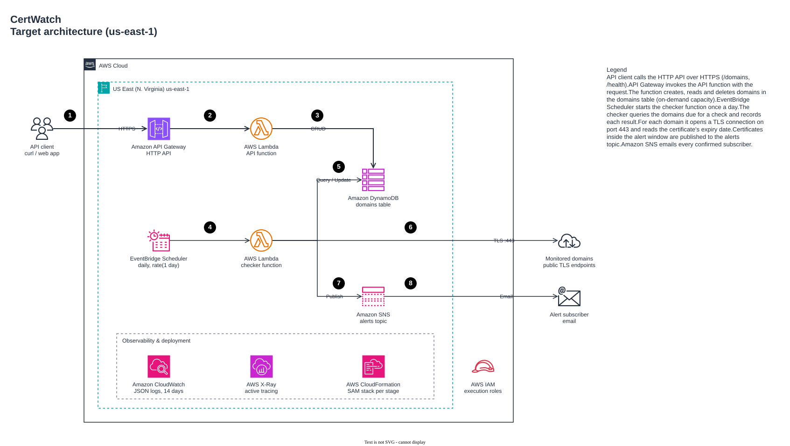

# CertWatch

A serverless SSL/TLS certificate expiry monitor on AWS. Register the domains you care about; CertWatch checks their certificates every day and emails you before one expires.

Built with **AWS SAM**, **Python 3.14**, **API Gateway (HTTP API)**, **Lambda**, **DynamoDB**, **EventBridge Scheduler** and **SNS**, tested locally against **LocalStack** and deployed through **GitHub Actions**.

## Architecture (target)

<picture>
  <source media="(prefers-color-scheme: dark)" srcset="docs/diagrams/dark/certwatch-architecture.png">
  
</picture>

Requests flow through API Gateway to a Lambda function backed by a DynamoDB table (steps 1-3). Once a day
EventBridge Scheduler starts a checker function that reads the table, opens a TLS connection to every
domain and publishes expiring certificates to SNS, which emails the subscribers (steps 4-8). Everything runs
in one SAM stack per stage, with structured logs, X-Ray tracing and one least-privilege role per function.

Deployment (target, phase 5): GitHub Actions lints and tests, including against LocalStack, then deploys
with short-lived OIDC credentials instead of stored AWS keys:
[delivery pipeline diagram](docs/diagrams/certwatch-delivery-pipeline.drawio.svg).

The diagram source is [`docs/diagrams/certwatch.drawio`](docs/diagrams/certwatch.drawio); open it in
[draw.io](https://www.drawio.com) or the VS Code Draw.io Integration extension.

## Quick start

Requirements: Python 3.14, AWS SAM CLI, Docker, and the LocalStack CLI for the integration tests.

```bash
make test      # unit tests (no Docker, no network)
make lint      # ruff + cfn-lint
make local     # health endpoint on http://127.0.0.1:3000 via sam local
```

Install the git hooks once per clone. Every commit and push is then scanned for secrets (gitleaks) and
checked for private keys, oversized files and merge-conflict markers:

```bash
pipx install pre-commit   # or: pip install pre-commit
pre-commit install        # hooks for pre-commit and pre-push, from .pre-commit-config.yaml
```

### Run the whole stack locally on LocalStack

```bash
make ls-up       # start LocalStack
make ls-deploy   # sam build + sam deploy to LocalStack; prints the API URL
make ls-test     # integration tests: HTTP API -> Lambda -> DynamoDB
make ls-destroy  # remove the stack (make ls-down stops LocalStack)
```

The `ls-*` targets use dummy credentials and an explicit LocalStack endpoint, so they cannot touch a real
AWS account whatever your default profile is. LocalStack's free Hobby plan does not emulate HTTP APIs
(API Gateway v2); the integration tests need a paid plan or its trial.

Run `make help` for every target.

## API

| Method   | Path                | Success | Description                                   |
|----------|---------------------|---------|-----------------------------------------------|
| `GET`    | `/health`           | 200     | Liveness check                                |
| `POST`   | `/domains`          | 201     | Register a domain to monitor                  |
| `GET`    | `/domains`          | 200     | List domains, paginated (`limit`, `next_token`) |
| `GET`    | `/domains/{domain}` | 200     | Read one domain                               |
| `PATCH`  | `/domains/{domain}` | 200     | Change `port` and/or `alert_days`             |
| `DELETE` | `/domains/{domain}` | 204     | Stop monitoring a domain                      |

```bash
curl -X POST "$API/domains" -H 'Content-Type: application/json' -d '{"domain": "example.com", "alert_days": 14}'
```
```json
{"domain": "example.com", "port": 443, "alert_days": 14,
 "created_at": "2026-09-22T03:35:00+00:00", "updated_at": "2026-09-22T03:35:00+00:00"}
```

- **`domain`** is normalised to lower case and punycode (`Example.COM.` and `example.com` are the same
  domain). Only public hostnames are accepted: no schemes, paths, ports, IP addresses or special-use names
  such as `localhost` and `.internal`. The daily checker connects to these hosts, so this is also its first
  defence against being pointed at internal addresses.
- **`port`** defaults to 443; **`alert_days`** (how many days before expiry to alert) defaults to 30.
- **Errors** always look like `{"error": {"code": "validation_error", "message": "..."}}`: `400` for invalid
  input, `404` for an unknown domain, `409` if the domain is already registered.
- **Listing** returns `{"items": [...], "next_token": "..."}`; pass `next_token` back to get the next
  page (`limit` 1-100, default 50). Items come back in no particular order.

## Testing

| Suite | Tests | Runs on | Command |
|-------|-------|---------|---------|
| Static checks | ruff, cfn-lint, `sam validate` | local | `make lint validate` |
| Unit | 100 | local, no Docker or network | `make test` |
| Integration | 9 | LocalStack (HTTP API → Lambda → DynamoDB) | `make ls-up ls-deploy ls-test` |

**Latest results** (phase 2, 2026-09-22): all checks pass; 100 unit and 9 integration tests passed; unit
coverage 83%. The strategy, what each test covers and the results of every phase are in
[docs/testing.md](docs/testing.md).

## Roadmap

- [x] **Phase 1**: scaffold, `GET /health`, unit tests, linting
- [x] **Phase 2**: domain CRUD API on DynamoDB, integration tests on LocalStack
- [ ] **Phase 3**: scheduled certificate checks and SNS email alerts
- [ ] **Phase 4**: deploy to AWS (`dev` stage), smoke tests
- [ ] **Phase 5**: CI/CD with GitHub Actions and OIDC (no stored AWS keys)
- [ ] **Phase 6**: auth, least-privilege IAM, tracing, alarms, security scanning
- [ ] **Phase 7**: docs, cost breakdown, design decisions
