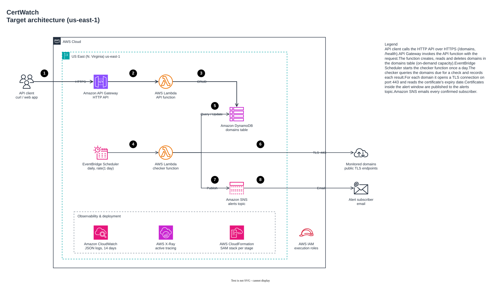

# CertWatch

A serverless SSL/TLS certificate expiry monitor on AWS. Register the domains you care about; CertWatch checks their certificates every day and emails you before one expires.

Built with **AWS SAM**, **Python 3.14**, **API Gateway (HTTP API)**, **Lambda**, **DynamoDB**, **EventBridge Scheduler** and **SNS**, tested locally against **LocalStack** and deployed through **GitHub Actions**.

## Architecture (target)

<picture>
  <source media="(prefers-color-scheme: dark)" srcset="docs/diagrams/dark/certwatch-architecture.png">
  
</picture>

Requests flow through API Gateway to a Lambda function backed by a DynamoDB table (steps 1-3). Once a day
EventBridge Scheduler starts a checker function that reads the table, opens a TLS connection to every
domain and publishes expiring certificates to SNS, which emails the subscribers (steps 4-8). Everything runs
in one SAM stack per stage, with structured logs, X-Ray tracing and one least-privilege role per function.

Deployment (target, phase 5): GitHub Actions lints and tests, including against LocalStack, then deploys
with short-lived OIDC credentials instead of stored AWS keys:
[delivery pipeline diagram](docs/diagrams/certwatch-delivery-pipeline.drawio.svg).

The diagram source is [`docs/diagrams/certwatch.drawio`](docs/diagrams/certwatch.drawio); open it in
[draw.io](https://www.drawio.com) or the VS Code Draw.io Integration extension.

Why it is built this way: each design choice is recorded as an architecture decision record in
[`docs/decisions/`](docs/decisions/README.md). Seven are accepted (AWS SAM, the HTTP API, DynamoDB on
demand, testing against LocalStack, the daily checker, the SSRF guard, and parsing certificates with
cryptography in a layer); deployment through GitHub Actions with OIDC is proposed for phase 5.

## Quick start

Requirements: Python 3.14, AWS SAM CLI, Docker, and the LocalStack CLI for the integration tests.

```bash
make test      # unit tests (no Docker, no network)
make lint      # ruff + cfn-lint
make local     # health endpoint on http://127.0.0.1:3000 via sam local
```

Install the git hooks once per clone. Every commit and push is then scanned for secrets (gitleaks) and
checked for private keys, oversized files and merge-conflict markers:

```bash
pipx install pre-commit   # or: pip install pre-commit
pre-commit install        # hooks for pre-commit and pre-push, from .pre-commit-config.yaml
```

### Run the whole stack locally on LocalStack

```bash
make ls-up       # start LocalStack
make ls-deploy   # sam build + sam deploy to LocalStack; prints the API URL
make ls-test     # integration tests: HTTP API -> Lambda -> DynamoDB, and the daily check
make ls-check    # run the certificate check once, now, and print its summary
make ls-destroy  # remove the stack (make ls-down stops LocalStack)
```

The `ls-*` targets use dummy credentials and an explicit LocalStack endpoint, so they cannot touch a real
AWS account whatever your default profile is. LocalStack's free Hobby plan does not emulate HTTP APIs
(API Gateway v2); the integration tests need a paid plan or its trial.

Run `make help` for every target.

## API

| Method   | Path                | Success | Description                                   |
|----------|---------------------|---------|-----------------------------------------------|
| `GET`    | `/health`           | 200     | Liveness check                                |
| `POST`   | `/domains`          | 201     | Register a domain to monitor                  |
| `GET`    | `/domains`          | 200     | List domains, paginated (`limit`, `next_token`) |
| `GET`    | `/domains/{domain}` | 200     | Read one domain                               |
| `PATCH`  | `/domains/{domain}` | 200     | Change `port` and/or `alert_days`             |
| `DELETE` | `/domains/{domain}` | 204     | Stop monitoring a domain                      |

```bash
curl -X POST "$API/domains" -H 'Content-Type: application/json' -d '{"domain": "example.com", "alert_days": 14}'
```
```json
{"domain": "example.com", "port": 443, "alert_days": 14,
 "created_at": "2026-09-22T03:35:00+00:00", "updated_at": "2026-09-22T03:35:00+00:00"}
```

- **`domain`** is normalised to lower case and punycode (`Example.COM.` and `example.com` are the same
  domain). Only public hostnames are accepted: no schemes, paths, ports, IP addresses or special-use names
  such as `localhost` and `.internal`. The daily checker connects to these hosts, so this is also its first
  defence against being pointed at internal addresses.
- **`port`** defaults to 443; **`alert_days`** (how many days before expiry to alert) defaults to 30.
- **Errors** always look like `{"error": {"code": "validation_error", "message": "..."}}`: `400` for invalid
  input, `404` for an unknown domain, `409` if the domain is already registered.
- **Listing** returns `{"items": [...], "next_token": "..."}`; pass `next_token` back to get the next
  page (`limit` 1-100, default 50). Items come back in no particular order.

## Checks and alerts

Once a day EventBridge Scheduler invokes the checker, which walks the whole table, reads every domain's
certificate and writes the result back onto its item. A run sends at most one email: a digest of
everything that needs attention. A domain inside its alert window is reported on every run until it is
renewed, which is the point of the service.

| Status | Meaning |
|---|---|
| `ok` | Valid and more than `alert_days` from expiry. Not alerted. |
| `expiring` | Valid, but `alert_days` or fewer from expiry |
| `expired` | Past its expiry date |
| `not_yet_valid` | Its start date is in the future |
| `blocked` | The name resolves to a non-public address, and was never connected to |
| `unresolvable` | No DNS answer |
| `unreachable` | Nothing answered on the port within the timeout |
| `handshake_failed` | Something answered, but no TLS certificate came back |

Every check records `last_checked_at` and `last_status`; a successful one adds `expires_at`,
`days_remaining` and `issuer`. A failed check keeps the expiry it last knew — stale information about a
host that is briefly unreachable beats none — and records `last_error` instead. The fields come back
from `GET /domains/{domain}` like any others:

```json
{"domain": "example.com", "port": 443, "alert_days": 30,
 "created_at": "2026-09-22T03:35:00+00:00", "updated_at": "2026-09-22T03:35:00+00:00",
 "last_checked_at": "2026-10-04T07:00:02+00:00", "last_status": "expiring",
 "expires_at": "2026-10-10T20:02:55+00:00", "days_remaining": 6, "issuer": "R11"}
```

The email a run sends:

```text
Subject: CertWatch dev: 3 certificates need attention

CertWatch checked 4 domain(s) in the dev stage at 2026-10-04T11:26:57+00:00.

3 need attention:

  EXPIRED   expired.badssl.com:443  expired on 2015-04-12T23:59:59+00:00 (4193 day(s) ago)
  EXPIRING  badssl.com:443  expires on 2026-12-28T20:02:55+00:00 (85 day(s) left, alert window 365 day(s))
  BLOCKED   localhost.localstack.cloud:443  resolves to ::1, a loopback address

The other 1 are valid and outside their alert window.
```

Certificates are read with verification deliberately turned off: an expired certificate — the whole
reason this service exists — fails a verifying handshake, which would hand back an error instead of the
expiry date. Nothing is trusted as a result; the certificate is parsed and reported, never acted on
([ADR-0008](docs/decisions/0008-parse-certificates-with-cryptography-in-a-lambda-layer.md)).

Before each connection the checker resolves the name again and refuses every address that is not
globally routable — private, loopback, link-local, carrier-grade NAT, multicast, or an IPv6 form
wrapping one of those — then connects to the vetted address with SNI set to the name. Registration
already restricts domains to public DNS names, but DNS changes afterwards, so a name that comes to
point inward is caught on the next run rather than dialled
([ADR-0006](docs/decisions/0006-defend-the-checker-against-ssrf-in-two-layers.md)).

### Settings

| Parameter | Default | Purpose |
|---|---|---|
| `AlertEmail` | *(empty)* | Address subscribed to the alert topic. AWS emails it a confirmation link, which must be clicked before any alert arrives. |
| `CheckSchedule` | `cron(0 7 * * ? *)` | When the daily run starts, in UTC |
| `CheckTimeoutSeconds` | `5` | How long one domain's TLS handshake may take |

```bash
sam deploy --parameter-overrides Stage=dev AlertEmail=you@example.com
```

A failed run alerts nobody, so the run itself is watched: CloudWatch alarms publish to the same topic
when the checker errors, and when a run passes 80% of its 15-minute timeout — the point at which
[ADR-0005](docs/decisions/0005-check-certificates-daily-with-eventbridge-scheduler-lambda-a.md) says to
fan the work out. A scheduled run that cannot be delivered after two retries lands in an SQS
dead-letter queue instead of disappearing.

## Testing

| Suite | Tests | Runs on | Command |
|-------|-------|---------|---------|
| Static checks | ruff, cfn-lint, `sam validate` | local | `make lint validate` |
| Unit | 174 | local, no Docker or network | `make test` |
| Integration | 14 | LocalStack (HTTP API → Lambda → DynamoDB, and the daily check) | `make ls-up ls-deploy ls-test` |

**Latest results** (phase 3, 2026-10-04): all checks pass; 174 unit and 14 integration tests passed; unit
coverage 83%. The strategy, what each test covers and the results of every phase are in
[docs/testing.md](docs/testing.md).

## Roadmap

- ✅ **Phase 1**: scaffold, `GET /health`, unit tests, linting
- ✅ **Phase 2**: domain CRUD API on DynamoDB, integration tests on LocalStack
- ✅ **Phase 3**: scheduled certificate checks and SNS email alerts
- ⬜ **Phase 4**: deploy to AWS (`dev` stage), smoke tests
- ⬜ **Phase 5**: CI/CD with GitHub Actions and OIDC (no stored AWS keys)
- ⬜ **Phase 6**: auth, least-privilege IAM, tracing, alarms, security scanning
- ⬜ **Phase 7**: docs, cost breakdown, design decisions

## License

Released under the [MIT License](LICENSE).
